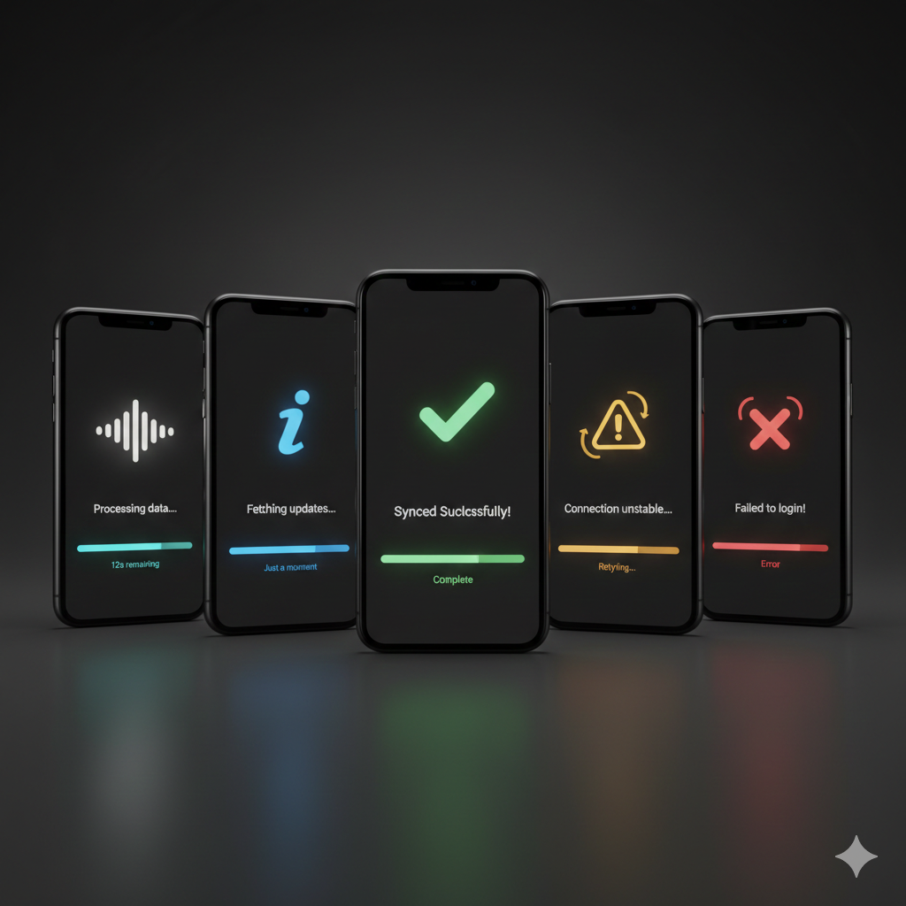

# Easy Loader Plus

A modern, interactive, and progress-aware loading indicator for Flutter. A spiritual successor to `flutter_easyloading`, built from the ground up with a focus on smooth animations and a delightful user experience.

## Preview

| Loading | Success |
| --- | --- |
|  |  |

## Features

- **Interactive Animations:** Choose from a variety of built-in animations like pulse, wave, bounce, and morph.
- **Progress Awareness:** Display determinate progress with smooth animations.
- **Multiple States:** Show loading, success, error, and info states with distinct animations.
- **Context-Free API:** Show and hide the loader from anywhere in your code, without `BuildContext`.
- **Highly Customizable:** Easily theme the loader to match your app's design.

## Installation

Add this to your package's `pubspec.yaml` file:

```yaml
dependencies:
  easy_loader_plus: ^1.0.0
```

## Usage

1.  Initialize `EasyLoader` in your `MaterialApp` builder:

```dart
import 'package:easy_loader_plus/easy_loader_plus.dart';

MaterialApp(
  builder: EasyLoader.init(),
  home: const MyHomePage(),
);
```

2.  Show and hide the loader:

```dart
// Show the loader
EasyLoader.show(status: 'Loading...');

// Hide the loader
EasyLoader.dismiss();

// Show a success message
EasyLoader.success('Upload complete!');

// Show an error message
EasyLoader.error('Upload failed.');
```

## Contributing

Contributions are welcome! Please feel free to submit a pull request.
